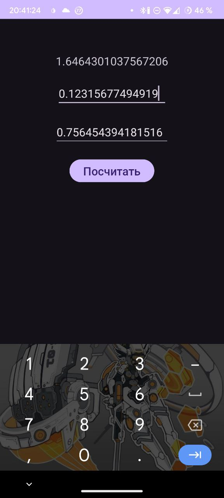
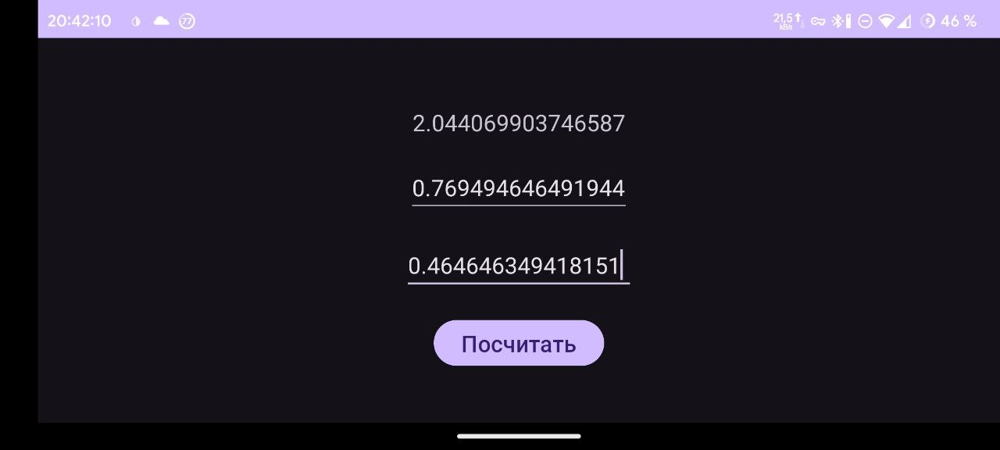

# Калькулятор Логнормального Распределения

Этот проект представляет собой Android-приложение, которое вычисляет логнормальное распределение на основе введенных пользователем значений среднего (μ) и дисперсии (σ²).

## Функциональные возможности

- Поля ввода для среднего (μ) и дисперсии (σ²)
- Кнопка для вычисления логнормального распределения
- Отображение вычисленного результата или сообщения об ошибке

## Используемые технологии

- Kotlin
- Android SDK
- Android Jetpack (ViewModel, LiveData, DataBinding)
- Gradle

## Структура проекта

- `MainActivity.kt`: Основная активность, которая обрабатывает взаимодействие с пользователем и обновляет интерфейс.
- `MainViewModel.kt`: ViewModel, которая обрабатывает ввод и выполняет вычисления.
- `Utils.kt`: Утилитные функции для проверки ввода и вычисления логнормального распределения.
- `activity_main.xml`: Файл разметки для основной активности.
- `UtilsUnitTests.kt`: Модульные тесты для утилитных функций.

## Начало работы

### Предварительные требования

- Android Studio
- Android SDK

### Установка

1. Клонируйте репозиторий:
    ```sh
    git clone https://github.com/yourusername/lognormal-calculator.git
    ```
2. Откройте проект в Android Studio.
3. Соберите проект для загрузки зависимостей.

### Запуск приложения

1. Подключите Android-устройство или запустите эмулятор.
2. Нажмите кнопку "Run" в Android Studio.


## Использование

1. Введите значение среднего (μ) в первое поле ввода.
2. Введите значение дисперсии (σ²) во второе поле ввода.
3. Нажмите кнопку "Вычислить".
4. Результат будет отображен под кнопкой.

# Скриншоты приложения


